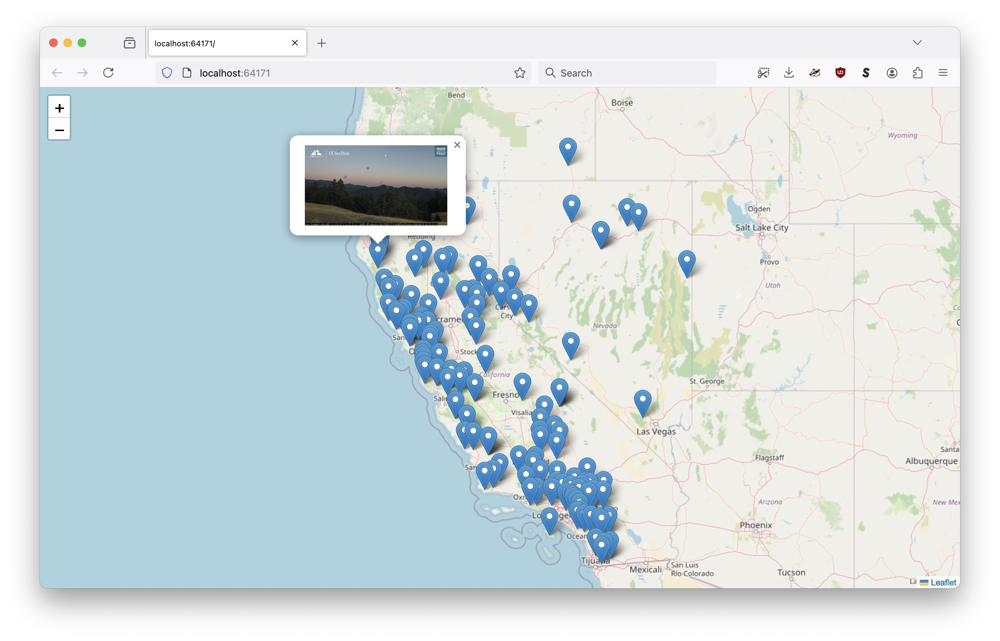
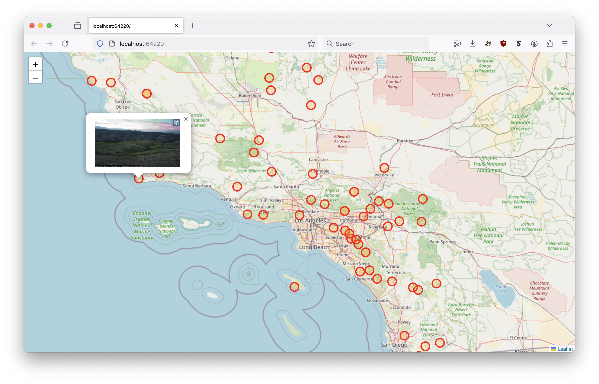

# go-geotagged-show

Command-line tool for showing geotagged photos on a map from an on-demand web server.

## Motivation

It's basically a simpler and dumber version of [geojson.io](https://geojson.io/) but for a folder of geotagged photos (specifically photos with GPS EXIF tags) that you can run locally from a single binary application. Also, the option for custom, local and private tile data.

## Documentation

Documentation (`godoc`) is incomplete at this time.

## Tools

```
$> make cli
go build -mod vendor -ldflags="-s -w" -o bin/show cmd/show/main.go
```

### bin

```
$> ./bin/show -h
Command-line tool for showing a folder of geotagged photos on a map from an on-demand web server.
Usage:
	 ./bin/show path(N) path(N)
Valid options are:
  -map-provider string
    	Valid options are: leaflet, protomaps (default "leaflet")
  -map-tile-uri string
    	A valid Leaflet tile layer URI. See documentation for special-case (interpolated tile) URIs. (default "https://tile.openstreetmap.org/{z}/{x}/{y}.png")
  -point-style string
    	A custom Leaflet style definition for point geometries. This may either be a JSON-encoded string or a path on disk.
  -port int
    	The port number to listen for requests on (on localhost). If 0 then a random port number will be chosen.
  -protomaps-theme string
    	A valid Protomaps theme label. (default "white")
  -style string
    	A custom Leaflet style definition for geometries. This may either be a JSON-encoded string or a path on disk.
  -verbose
    	Enable verbose (debug) logging.

```

#### For example



```
$> ./bin/show -verbose /usr/local/california-landscapes/

2024/09/01 10:32:42 INFO Add filesystem path=/usr/local/california-landscapes
2024/09/01 10:32:42 DEBUG Verbose logging enabled
2024/09/01 10:32:42 DEBUG Add feature for photo path=111892269932954958.jpg image:path=111892269932954958.jpg latitude=37.858333333333334 longitude=-122.14277777777778
2024/09/01 10:32:42 DEBUG Add feature for photo path=111926480833581885.jpg image:path=111926480833581885.jpg latitude=37.45333333333333 longitude=-122.37527777777777
2024/09/01 10:32:42 DEBUG Add feature for photo path=111919640654218972.jpg image:path=111919640654218972.jpg latitude=39.11555555555556 longitude=-123.23305555555555
... and so on
2024/09/01 10:32:42 DEBUG Add feature for photo path=113024968664322222.jpg image:path=113024968664322222.jpg latitude=39.94444444444444 longitude=-122.33999999999999
2024/09/01 10:32:42 DEBUG Add feature for photo path=112983207871215439.jpg image:path=112983207871215439.jpg latitude=33.91361111111111 longitude=-117.73805555555556
2024/09/01 10:32:42 DEBUG Start server
2024/09/01 10:32:42 DEBUG HEAD request succeeded url=http://localhost:64171
2024/09/01 10:32:42 INFO Server is ready and features are viewable url=http://localhost:64171
```

Or with custom styles:

```
$> ./bin/show \
	-point-style '{"radius": 10, "color": "red", "fillColor": "orange" }' \
	/usr/local/california-landscapes/
	
2024/09/01 10:35:51 INFO Add filesystem path=/usr/local/california-landscapes
2024/09/01 10:35:51 INFO Server is ready and features are viewable url=http://localhost:64220
```



## Experimental

### Showing geotagged photos using the Flickr API


```
$> ./bin/show \
	-verbose \
	-root 'method=flickr.photosets.getPhotos&photoset_id=72157629455113026&user_id=35034348999%40N01' \
	-flickr-client-uri 'oauth1://?consumer_key={KEY}&consumer_secret={SECRET}&oauth_token={TOKEN}&oauth_token_secret={SECRET}' \
	'flickr://?client-uri={flickr-client-uri}'

2024/09/02 13:17:45 DEBUG Verbose logging enabled
2024/09/02 13:17:45 DEBUG Open file name="method=flickr.photosets.getPhotos&photoset_id=72157629455113026&user_id=35034348999%40N01"
2024/09/02 13:17:45 DEBUG File does not match photo ID or URL, assuming SPR entry name="method=flickr.photosets.getPhotos&photoset_id=72157629455113026&user_id=35034348999%40N01"
2024/09/02 13:17:45 DEBUG Read dir name="method=flickr.photosets.getPhotos&photoset_id=72157629455113026&user_id=35034348999%40N01"
...and so on
2024/09/02 13:17:51 DEBUG Start server
2024/09/02 13:17:51 DEBUG HEAD request succeeded url=http://localhost:52284
2024/09/02 13:17:52 INFO Server is ready and features are viewable url=http://localhost:52284
2024/09/02 13:17:55 DEBUG Open file name=7137/6925950990_62c9dd820c_o.jpg
2024/09/02 13:17:55 DEBUG Derive relative path name=7137/6925950990_62c9dd820c_o.jpg "rel path"=/7137/6925950990_62c9dd820c_o.jpg
2024/09/02 13:17:55 DEBUG Fetch photo name=7137/6925950990_62c9dd820c_o.jpg url=https://live.staticflickr.com/7137/6925950990_62c9dd820c_o.jpg
2024/09/02 13:17:55 DEBUG Return file name=7137/6925950990_62c9dd820c_o.jpg url=https://live.staticflickr.com/7137/6925950990_62c9dd820c_o.jpg "file name"=/7137/6925950990_62c9dd820c_o.jpg len=1734531
...and so on
```

The ability to show geotagged photos from Flickr on a local map using the Flickr API is both experimental and a little finnicky (reflecting its experimental nature). It is possible, likely even, that the flags and the order in which they are passed will change.

As mentioned (below) the code to read photos uses the [Go language io/fs.FS abstraction](https://benjamincongdon.me/blog/2021/01/21/A-Tour-of-Go-116s-iofs-package/). The default abstraction is one for the local filesystem. There is also support for second abstraction using the Flickr API as implemented using the [aaronland/go-flickr-api](https://github.com/aaronland/go-flickr-api/tree/main/fs) package.

In the example above, there are (2) parameter flags and (1) "path" being passed to the `show` command. These flags and the order in which are being passed reflect the ongoing work to best determine how things should work with multiple `io/fs.FS` implementations and their specific requirements.

```
-root 'method=flickr.photosets.getPhotos&photoset_id=72157629455113026&user_id=35034348999%40N01'
```

The `go-flickr-api` filesystem abstraction works by treating the value passed to the `fs.ReadDir` method as query parameters to pass to the Flickr API in order to return "standard places response" (list) results. Ideally this would be passed in not as a flag but as a path since it "looks" like a conventional path.

```
-flickr-client-uri 'oauth1://?consumer_key={KEY}&consumer_secret={SECRET}&oauth_token={TOKEN}&oauth_token_secret={SECRET}'
```

This is a helper flag. If it is not empty its value will be used to replace any instance of the string `{flickr-client-uri}` in all the paths passed to the `show` command. It is expected to be a valid [aaronland/go-flickr-api/client.Client](https://github.com/aaronland/go-flickr-api?tab=readme-ov-file#clients) URI.

For example:

```
'flickr://?client-uri={flickr-client-uri}'
```

This is the "path" for the photos to show on a map. Or rather it's signal to use the Flickr API filesystem abstraction and the "path" (or "root") determining which photos to fetch is defined above in the `-root` flag.

This is not ideal. It will change. In the meantime, it _does_ work which is pretty cool.

## Under the hood

This is an early-stage project. It doesn't do very much _by design_ but that doesn't mean everything has been done yet. Notably:

* Titles, dates or anything that might be considered a "label" for geotagged images are not supported. They will be but I haven't worked out the best way to do that yet.

* Although the command-line `show` tool is designed to serve folders on the local filesystem the actual code operates on [Go language io/fs.FS instances](https://benjamincongdon.me/blog/2021/01/21/A-Tour-of-Go-116s-iofs-package/) which means that, technically, it can serve geotagged photos from anything that implements the `fs.FS` interface. That might include an S3 bucket or, photos hosted on a third-party service [like Flickr](https://github.com/aaronland/go-flickr-api/tree/main/fs).

* The user interface could do with a simple (no frameworks) carousel for showing all the images without needing to click on their markers. Pull requests are welcome for this.

* Likewise, some kind of marker clustering to account for ["red dot fever"](https://googleearthdesign.blogspot.com/2009/05/clustering-placemarks.html) is probably necessary.

## See also

* https://github.com/sfomuseum/go-www-show
* https://github.com/sfomuseum/go-geojson-show
* https://github.com/rwcarlsen/goexif
* https://github.com/aaronland/go-flickr-api
* https://pkg.go.dev/io/fs