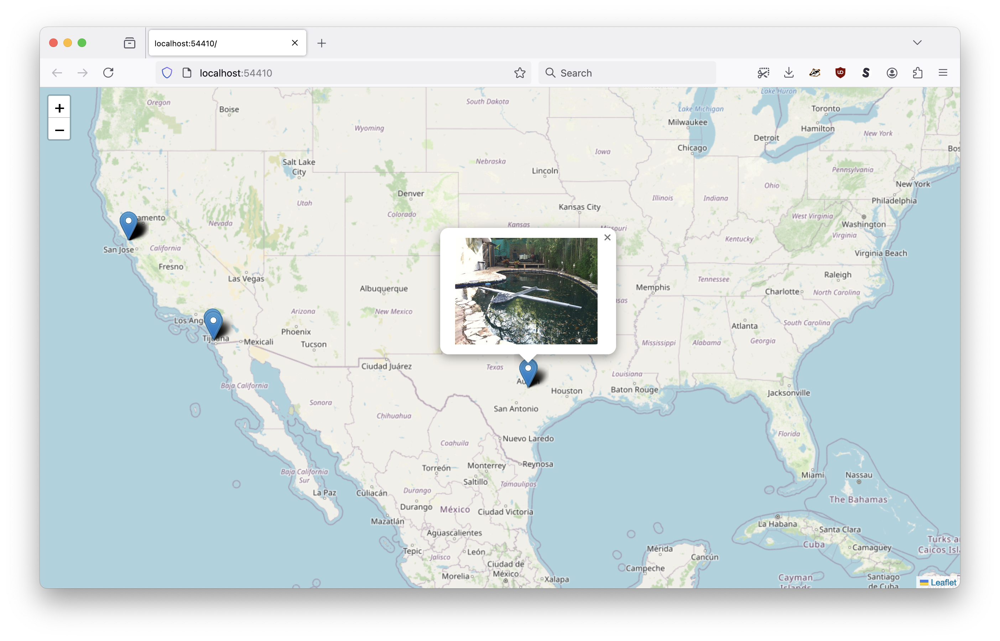

# go-geotagged-show

Command-line tool for showing geotagged photos on a map from an on-demand web server.

## Motivation

It's basically a simpler and dumber version of [geojson.io](https://geojson.io/) but for a folder of geotagged photos (specifically photos with GPS EXIF tags) that you can run locally from a single binary application. Also, the option for custom, local and private tile data.

## Documentation

Documentation (`godoc`) is incomplete at this time.

## Tools

```
$> make cli
go build -mod vendor -ldflags="-s -w" -o bin/show cmd/show/main.go
```

### bin

```
$> ./bin/show -h
Command-line tool for showing one or more collections of geotagged photos on a map from an on-demand web server.
Usage:
	 ./bin/show uri(N) uri(N)
Valid options are:
  -flickr-client-uri string
    	This is a helper flag. If defined, any of the URIs with the "flickr://" scheme passed to the (show) tool containing the string "{flickr-client-uri}" will have those strings wil be replaced with this value. Expected to be a valid aaronland/go-flickr-api/client.Client URI
  -flickr-root-uri string
    	This is a helper flag. If defined, any of the URIs with the "flickr://" scheme passed to the (show) tool containing the string "{flickr-root-uri}" will have those strings wil be replaced with this value. Expected to be a string-encoded set of query parameters that can be passed to the aaronland/go-flickr-api/fs.ReadDir method.
  -map-provider string
    	Valid options are: leaflet, protomaps (default "leaflet")
  -map-tile-uri string
    	A valid Leaflet tile layer URI. See documentation for special-case (interpolated tile) URIs. (default "https://tile.openstreetmap.org/{z}/{x}/{y}.png")
  -point-style string
    	A custom Leaflet style definition for point geometries. This may either be a JSON-encoded string or a path on disk.
  -port int
    	The port number to listen for requests on (on localhost). If 0 then a random port number will be chosen.
  -protomaps-theme string
    	A valid Protomaps theme label. (default "white")
  -style string
    	A custom Leaflet style definition for geometries. This may either be a JSON-encoded string or a path on disk.
  -verbose
    	Enable verbose (debug) logging.
```

#### Filesystem URIs

The `show` tool works by parsing one or more filesystem "URIs" containing geotagged photos. There are a number of filesystems supported by default (and described below) but other can be written so long as they conform to the [GeotaggedFS interface](geotagged_fs.go).

The following filesystem URIs are supported by default. Filesystem URIs without a known, registered scheme are assumed to be `local://` (a folder on the local filesystem).

##### azblob:// (Azure Blob Storage)

Read geotagged photos from an Azure Blob Storage container. URIs take the form of:

```
azblob://{CONTAINER}?PARAMETERS}
```

For details consult the `gocloud.dev/blob` [Azure Blob Storage documentation](https://gocloud.dev/howto/blob/#azure).

##### file:// (Local filesystem)

Read geotagged photos from a folder on the local filesystem. URIs take the form of:

```
file:///{PATH}/{TO}/{FOLDER}
```

For details consult the `gocloud.dev/blob` [Google Cloud Storage documentation](https://gocloud.dev/howto/blob/#gcs).

##### local:// (Local filesystem)

Read geotagged photos from a folder on the local filesystem. URIs take the form of:

```
local:///{PATH}/{TO}/{FOLDER}
```

##### flickr:// (Flickr API)

Read geotagged photos from the Flickr API. URIs take the form of:

```
flickr://?{PARAMETERS}
```

Valid parameters are:

| Name | Value | Required | Notes |
| --- | --- | --- | --- |
| client-uri | string | yes | A valid [aaronland/go-flickr-api/client.Client](https://github.com/aaronland/go-flickr-api) URI |
| root | string | yes | a string-encoded set of query parameters that can be passed to the [aaronland/go-flickr-api/fs.ReadDir](https://github.com/aaronland/go-flickr-api) method. | 

For details consult the [Flickr API documentation](https://www.flickr.com/services/api/).

#### gc:// (Google Cloud Storage)

Read geotagged photos from a Google Cloud Storage bucket. URIs take the form of:
 
```
gc://{BUCKET}?paramters
```

For details consult the `gocloud.dev/blob` [Google Cloud Storage documentation](https://gocloud.dev/howto/blob/#gcs).

#### s3:// (Amazon AWS S3 Storage)

Read geotagged photos from an Amazon AWS S3 Storage bucket. URIs take the form of:

```
s3://{BUCKET}?{PARAMETERS}
```

For details consult the `gocloud.dev/blob` [S3 documentation](https://gocloud.dev/howto/blob/#s3).

#### s3blob:// (Amazon AWS S3 Storage)

Read geotagged photos from an Amazon AWS S3 Storage bucket. URIs take the form of:

```
s3blob://{BUCKET}?{PARAMETERS}
```

This is a thin wrapper around the default `s3://` implementation which adds support for specifying AWS credentials using a `?credentials=` parameters.

For details consult the `gocloud.dev/blob` [S3 documentation](https://gocloud.dev/howto/blob/#s3) and the [aaronland/go-aws-auth Credentials documentation](https://github.com/aaronland/go-aws-auth?tab=readme-ov-file#credentials).

#### Examples


```
$> ./bin/show -verbose /usr/local/california-landscapes/

2024/09/01 10:32:42 INFO Add filesystem path=/usr/local/california-landscapes
2024/09/01 10:32:42 DEBUG Verbose logging enabled
2024/09/01 10:32:42 DEBUG Add feature for photo path=111892269932954958.jpg image:path=111892269932954958.jpg latitude=37.858333333333334 longitude=-122.14277777777778
2024/09/01 10:32:42 DEBUG Add feature for photo path=111926480833581885.jpg image:path=111926480833581885.jpg latitude=37.45333333333333 longitude=-122.37527777777777
2024/09/01 10:32:42 DEBUG Add feature for photo path=111919640654218972.jpg image:path=111919640654218972.jpg latitude=39.11555555555556 longitude=-123.23305555555555
... and so on
2024/09/01 10:32:42 DEBUG Add feature for photo path=113024968664322222.jpg image:path=113024968664322222.jpg latitude=39.94444444444444 longitude=-122.33999999999999
2024/09/01 10:32:42 DEBUG Add feature for photo path=112983207871215439.jpg image:path=112983207871215439.jpg latitude=33.91361111111111 longitude=-117.73805555555556
2024/09/01 10:32:42 DEBUG Start server
2024/09/01 10:32:42 DEBUG HEAD request succeeded url=http://localhost:64171
2024/09/01 10:32:42 INFO Server is ready and features are viewable url=http://localhost:64171
```

Or with custom styles:

```
$> ./bin/show \
	-point-style '{"radius": 10, "color": "red", "fillColor": "orange" }' \
	/usr/local/california-landscapes/
	
2024/09/01 10:35:51 INFO Add filesystem path=/usr/local/california-landscapes
2024/09/01 10:35:51 INFO Server is ready and features are viewable url=http://localhost:64220
```


## Experimental

### Showing geotagged photos using the Flickr API


```
$> ./bin/show \
	-flickr-client-uri 'oauth1://?consumer_key={KEY}&consumer_secret={SECRET}&oauth_token={TOKEN}&oauth_token_secret={SECRET}' \
	-flickr-root-uri 'method=flickr.photosets.getPhotos&photoset_id=72157629455113026&user_id=35034348999@N01' \
	'flickr://?client-uri={flickr-client-uri}&root={flickr-root-uri}'

2024/09/02 13:17:45 DEBUG Verbose logging enabled
2024/09/02 13:17:45 DEBUG Open file name="method=flickr.photosets.getPhotos&photoset_id=72157629455113026&user_id=35034348999%40N01"
2024/09/02 13:17:45 DEBUG File does not match photo ID or URL, assuming SPR entry name="method=flickr.photosets.getPhotos&photoset_id=72157629455113026&user_id=35034348999%40N01"
2024/09/02 13:17:45 DEBUG Read dir name="method=flickr.photosets.getPhotos&photoset_id=72157629455113026&user_id=35034348999%40N01"
...and so on
2024/09/02 13:17:51 DEBUG Start server
2024/09/02 13:17:51 DEBUG HEAD request succeeded url=http://localhost:52140
2024/09/02 13:17:52 INFO Server is ready and features are viewable url=http://localhost:52140
2024/09/02 13:17:55 DEBUG Open file name=7137/6925950990_62c9dd820c_o.jpg
2024/09/02 13:17:55 DEBUG Derive relative path name=7137/6925950990_62c9dd820c_o.jpg "rel path"=/7137/6925950990_62c9dd820c_o.jpg
2024/09/02 13:17:55 DEBUG Fetch photo name=7137/6925950990_62c9dd820c_o.jpg url=https://live.staticflickr.com/7137/6925950990_62c9dd820c_o.jpg
2024/09/02 13:17:55 DEBUG Return file name=7137/6925950990_62c9dd820c_o.jpg url=https://live.staticflickr.com/7137/6925950990_62c9dd820c_o.jpg "file name"=/7137/6925950990_62c9dd820c_o.jpg len=1734531
...and so on
```

The ability to show geotagged photos from Flickr on a local map using the Flickr API is both experimental and a little finnicky (reflecting its experimental nature).

In the example above, there are (2) parameter flags and (1) "path" (or URI) being passed to the `show` command. They are:

```
-flickr-client-uri 'oauth1://?consumer_key={KEY}&consumer_secret={SECRET}&oauth_token={TOKEN}&oauth_token_secret={SECRET}'
```

This is a helper flag. If it is not empty its value will be used to replace any instance of the string `{flickr-client-uri}` in all the paths passed to the `show` command. It is expected to be a valid [aaronland/go-flickr-api/client.Client](https://github.com/aaronland/go-flickr-api?tab=readme-ov-file#clients) URI.

```
-flickr-root-uri 'method=flickr.photosets.getPhotos&photoset_id=72157629455113026&user_id=35034348999@N01' 
```

This is another helper flag. If it is not empty its value will be used to replace any instance of the string `{flickr-root-uri} in all the paths passed to the `show` command. It is expected to be a string-encoded query string.

The `go-flickr-api` filesystem abstraction works by treating the value passed to the `fs.ReadDir` method as query parameters to pass to the Flickr API in order to return "standard places response" (list) results. In this case the "root" is the list of the photos returned by the [flickr.photosets.getPhotos](https://www.flickr.com/services/api/flickr.photosets.getPhotos.htm) API method, for the photoset with ID [72157629455113026](https://www.flickr.com/photos/straup/albums/72157629455113026) (belonging to user [35034348999@N01](https://www.flickr.com/photos/straup/)).

Finally, the "path" (or URI) passed to the `show` command looks like this:

```
'flickr://?client-uri={flickr-client-uri}&root={flickr-root-uri}'
```

Note the use of the `{flickr-client-uri}` and `{flickr-root-uri}` replacement strings which would otherwise need to be URL-escaped and then everything would be even harder to read than it already is.

_The documentation for paths (URIs) is incomplete as of this writing._

You can pass multiple "paths" (or URIs, really) to the `show` command. For example, here's how you would show both geotagged photos from Flickr and a local folder:

```
$> ./bin/show \
	-flickr-client-uri 'oauth1://?consumer_key={KEY}&consumer_secret={SECRET}&oauth_token={TOKEN}&oauth_token_secret={SECRET}' \
	-flickr-root-uri 'method=flickr.photosets.getPhotos&photoset_id=72157629455113026&user_id=35034348999@N01' \
	'flickr://?client-uri={flickr-client-uri}&root={flickr-root-uri}'
	/usr/local/california-landscapes
```

_Paths (URIs) without a registered scheme are assumed to be "local"._

Or, all the geotagged photos from multiple Flickr sources (two different albums). Notice how this command does not use the `-flickr-root-uri` replacement flag since there is more than one Flickr source so the `?root=` parameter is URL-escaped and a bit hard look at:

```
$> ./bin/show \
	-flickr-client-uri 'oauth1://?consumer_key={KEY}&consumer_secret={SECRET}&oauth_token={TOKEN}&oauth_token_secret={SECRET}' \
	'flickr://?client-uri={flickr-client-uri}&root=method%3Dflickr.photosets.getPhotos%26photoset_id%3D72157629455113026%26user_id%3D35034348999%40N01'
	'flickr://?client-uri={flickr-client-uri}&root=method%3Dflickr.photosets.getPhotos%26photoset_id%3D72157629227224224%26user_id%3D35034348999%40N01'
```



## Under the hood

This is an early-stage project. It doesn't do very much _by design_ but that doesn't mean everything has been done yet. Notably:

* Titles, dates or anything that might be considered a "label" for geotagged images are not supported. They will be but I haven't worked out the best way to do that yet.

* Although the command-line `show` tool is designed to serve folders on the local filesystem the actual code operates on [Go language io/fs.FS instances](https://benjamincongdon.me/blog/2021/01/21/A-Tour-of-Go-116s-iofs-package/) which means that, technically, it can serve geotagged photos from anything that implements the `fs.FS` interface. That might include an S3 bucket or, photos hosted on a third-party service [like Flickr](https://github.com/aaronland/go-flickr-api/tree/main/fs). These details are still being worked out in this package's [GeotaggedFS](geotagged_fs.go) interface.

* The user interface could do with a simple (no frameworks) carousel for showing all the images without needing to click on their markers. Pull requests are welcome for this.

* Likewise, some kind of marker clustering to account for ["red dot fever"](https://googleearthdesign.blogspot.com/2009/05/clustering-placemarks.html) is probably necessary.

## See also

* https://github.com/sfomuseum/go-www-show
* https://github.com/sfomuseum/go-geojson-show
* https://github.com/rwcarlsen/goexif
* https://github.com/aaronland/go-flickr-api
* https://pkg.go.dev/io/fs